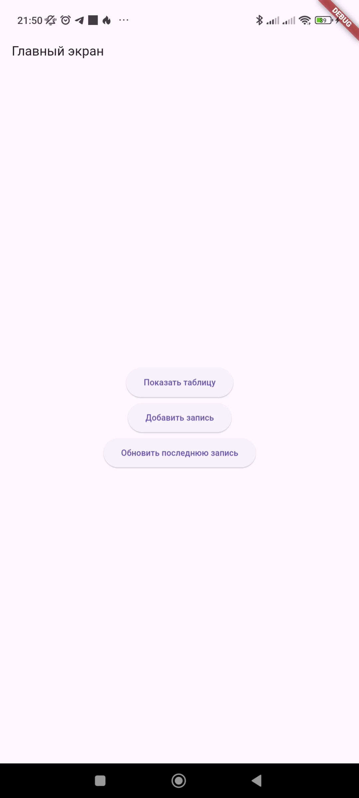
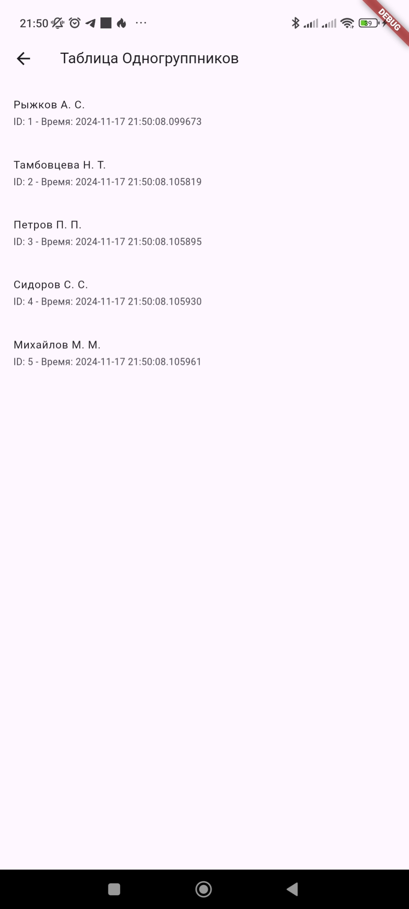
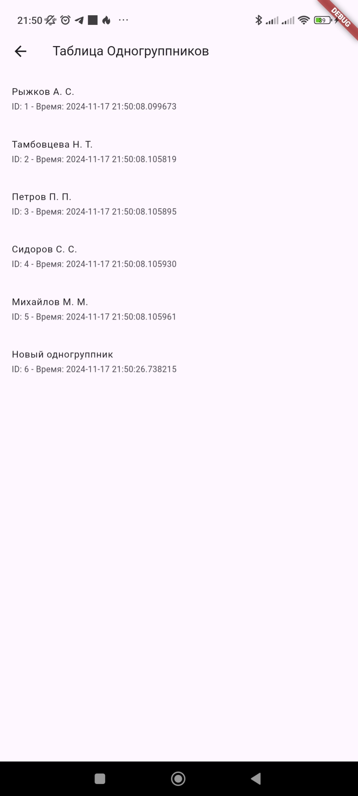
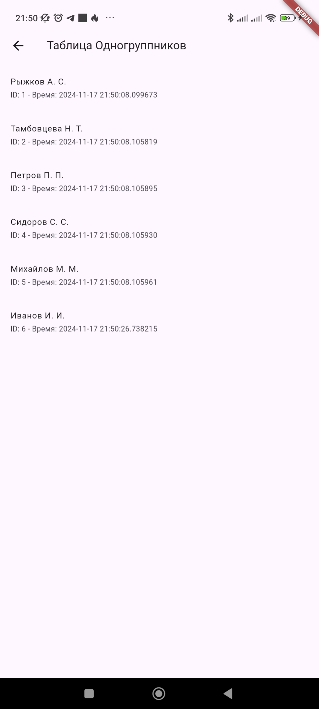

# Лабораторная работа №3. Работа с базой данных

Цель работы: Изучить работу Android приложения с базой данных.

   *Выполнила*: Иволгина Елизавета  
    *Язык*: Dart
    
   *Задание 1*

## Описание
Приложение включает два экрана:

1. **Главный экран**:
    - Содержит три кнопки:
        - Показать таблицу (переход к экрану с записями)
        - Добавить новую запись
        - Обновить последнюю запись
        

2. **Экран таблицы**:
    - Показывает все записи из базы данных.
    - Использует `ListView` для отображения записей.


**При нажатии на кнопку "Новая запись"** в таблицу добавляется "Новый одногруппник"

**При нажатии на кнопку "Обновить последнюю запись"** последняя запись таблицы меняется на "Иванов И.И."

База данных создается с использованием SQLite, и каждая запись содержит следующие поля:
- id (автоинкрементный ключ)
- fio (ФИО студента)
- time_added (время добавления записи)

## Как работает?
При запуске приложения база данных очищается, а затем заполняется пятью тестовыми записями. Это делается в функции `_clearDatabase()`:
```dart
Future<void> _clearDatabase() async {
  await DatabaseHelper().clearDatabase();
 ```
 ### Главный экран
 На главном экране представлены три основные функции:
 - Показать таблицу - открывающая другой экран.
 ```
 ElevatedButton(
  onPressed: () async {
    Navigator.push(
      context,
      MaterialPageRoute(builder: (context) => ViewRecordsScreen()),
    );
  },
  child: Text('Показать таблицу'),
)
 ```
 - Добавить запись
```
ElevatedButton(
  onPressed: () async {
    await DatabaseHelper().addRecord('Новый одногруппник');
  },
  child: Text('Добавить запись'),
)
```
- Обновить последнюю запись
```
ElevatedButton(
  onPressed: () async {
    await DatabaseHelper().updateLastRecord();
  },
  child: Text('Обновить последнюю запись'),
)
```
### Экран таблицы
Экран таблицы отображает данные с помощью `FutureBuilder` и ``ListView``:
```
FutureBuilder<List<Map<String, dynamic>>>(
  future: records,
  builder: (context, snapshot) {
    if (snapshot.connectionState == ConnectionState.waiting) {
      return Center(child: CircularProgressIndicator());
    }
    if (!snapshot.hasData || snapshot.data!.isEmpty) {
      return Center(child: Text('Нет записей в базе данных.'));
    }
    var students = snapshot.data!;
    return ListView.builder(
      itemCount: students.length,
      itemBuilder: (context, index) {
        var student = students[index];
        return ListTile(
          title: Text(student['fio']),
          subtitle: Text('ID: ${student['id']} - Время: ${student['time_added']}'),
        );
      },
    );
  },
);
```
### Работа с базой данных
База данных управляется с помощью класса `DatabaseHelper`. Основные методы:
- Добавление записи:
```
Future<void> addRecord(String fio) async {
  final db = await database;
  await db.insert('Одногруппники', {
    'fio': fio,
    'time_added': DateTime.now().toString(),
  });
}
```
- Обновление последней записи
```
Future<void> updateLastRecord() async {
  final db = await database;
  var lastRecord = await db.rawQuery('SELECT * FROM Одногруппники ORDER BY id DESC LIMIT 1');
  if (lastRecord.isNotEmpty) {
    await db.update(
      'Одногруппники',
      {'fio': 'Иванов И. И.'},
      where: 'id = ?',
      whereArgs: [lastRecord[0]['id']],
    );
  }
}
```
- Получение всех записей
```
Future<List<Map<String, dynamic>>> getAllRecords() async {
  final db = await database;
  return await db.query('Одногруппники');
}
```
### Как собрать   
* Установите Flutter SDK.
* Настройте Android studio: Установите плагины Flutter и Dart.
1. Загрузите репозиторий
2. Запустите Android Studio
3. Нажмите на "Open" и выберите папку с проектом
4. Выберите эмулятор(или подключите реальное устройство)
5. Нажмите "Run"